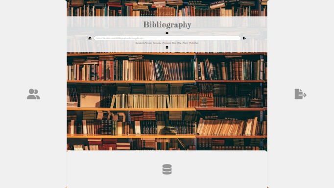

# Bibliography
A bibliography app based on Ruby on Rails, with a responsive HTML frontend.

I am just starting out with this one, so there is not much yet to tell about it, except for the design objectives.

## Design Objectives
1. Should have **a simple but nice HTML frontend** that is as responsive as possible, so that it is always fun to use it, whether on a smartphone or laptop in a library, or at home on a big screen.
2. Should **satisfy scientific requirements** (see below for details).
3. Should be **as accessible as possible**, that is: play nicely with screen readers and comparable clients.
4. Should be **as "connectable" as possible**, that is: plenty of import and export compatibilities to other bibliographic software and formats like Bibtex, Endnote, and Co.
5. Should **"degrade gracefully" also in terms of storage**: when there is no server around, should default to the Local Storage of the browser, with an easy option to save the current data to a disk file using JSON.
6. Should be **useable as a HTML file from disk** as well as **an URL to a (local) server**.
7. Should **contain a seperate server** that is easily set up for wider local use allowing to share datasets and collections.
8. Should allow to **manage citations** bound to a referenced publication. These citations should be taggable and eportable inside custom collections/sets related to those tags.

## Usecases Considered
- a **private person** managing her/his books on the shelf.
- a **scientist** managing her/his bibliographic references for use in publications, including exact references to citations.
- a **(scientific) institution** maintaining a local library, with the need to manage multiple copies of a single book, local signatures, and borrowings.
- a **(scientific) working group** sharing a bibliographic stock and discourse.

## About Scientifc Requirements
"Scientific requirements" is a very broad term, but there are some general usecases that can be applied to any scientific working:

- a scientific bibliographic reference **has to be rocksolid**! There has to be an exact date of publication, a place, a publisher, etc. - the reference has to be found unambigously, if someone is looking for it. So the app should always cry for those details, until the user provides them properly - BUT: even uncomplete references should be saved for later completion. There should be an option in the settings to turn "scientific requirements" on/off, so that a private person managing her/his books on the shelf is not bothered by the app.
- a scientific publication nearly always **needs a very concrete format of bibliographic references**, depending on the subject area and the circumstances of publication, for example a journal, an anthology, or a stand-alone publication. That is: the same stock of bibliographic references needs to be easily exported to a very concrete text format, for example: &lt;author-surname&gt;,&lt;author-prename&gt;. &lt;year-of-publication&gt;. &lt;title&gt;:&lt;subtitle&gt;. &lt;place-of-publication&gt;: &lt;publisher&gt; - and an hour later the required format for another publication is totally different. So the app should allow for an export into the required output format, simply by asking the user for a template of the required form, suggesting some common default options.
- some scientific research has **the need for very special bibliographic details**, for example literature studies related to prominent authors like Shakespeare or Goethe, and philosophic studies concerned with many different translations of ancient philosophers. The app should allow to take care of those minute details by providing a possibility to easily define needed data-fields, grouping related publications in views, and saving the exact publication reference inside any citations.
- some other scientific research has the need **to reference sources that do not easily fit into a classical bibliographic specification**, for example big datasets available online via a special webservice or as a special database. The app should also take care of the necessary details, again by prodiving a possibility to easily define custom data-fields or by providing such fields directly in the underlying model.
- every reference to **an online source needs to be intact** in the moment of exporting a bibliography for publication purposes. The app should take care of this by pinging the referenced link and aiding the scientific user in ensuring this. 

