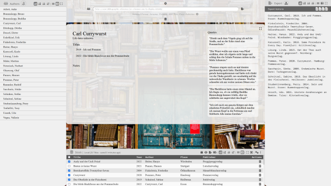

# Bibliography
A single-page HTML/JS app for the management of bibliographic references, quotes, and notes.

*(The contents of the initial Readme file with the layout of the design objectives, use cases considered, and definition of 'scientific requirements' has been moved to the documentation folder.)*

## Features
- Management of books, authors, bibliographic references, quotes, and notes - adhering to scientific requirements
- Export of data to JSON
- PDF export of bibliographic lists
- Utilizes browser storage (no need for local installation)
- Multi-language support (English and German will be actively developed)
- Import/Export from/to BibTex files
- Screensaver showing quotes and notes

## Development Plan (Projected Milestones)
- **October 2022**: first public release with all features savely useable, and use of Indexed DB for storage (until then use of Local Storage) 
- **December 2022**: second public release with the option to install locally as desktop app (utilizing Electron) and filebased data storage
- **February 2023**: third public release with extended import/export options to maximize compability with other bibliographic software
- **April 2023**: fourth public release with an integrated search engine connected to publicly available library apis

I also plan to integrate some kind of server setup, so that libraries could serve their books stock as catalog, but did not yet make any decision on the technologies involved.
Initially such a server setup was planned as a Ruby on Rails app, but now I consider using a node server/service so that every installation (December Release) could act as it's own server. More planning needed. 